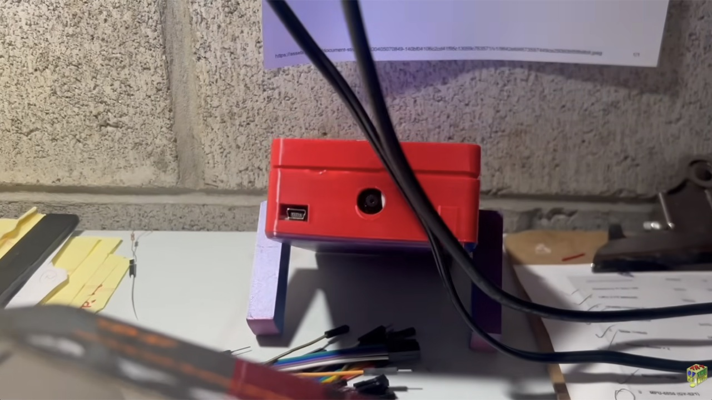
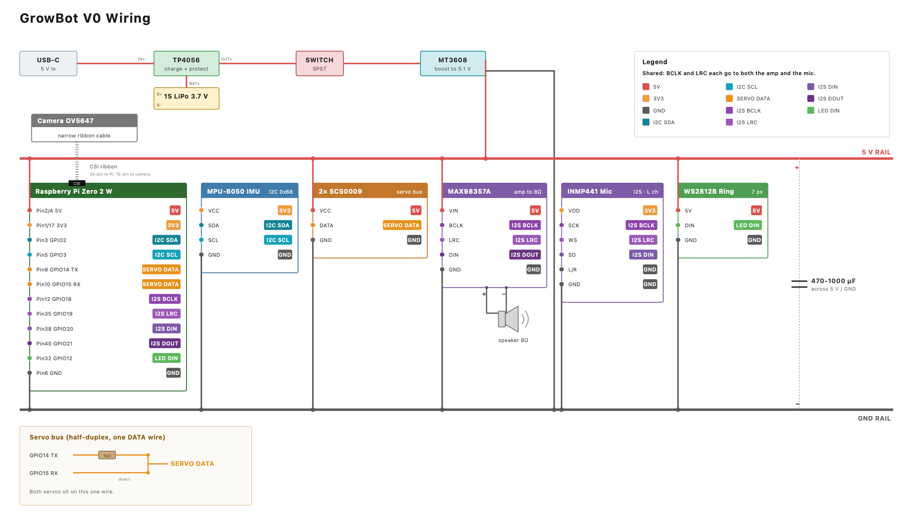

# GrowBot V0

▶ **[Watch the build video](https://www.youtube.com/watch?v=S67z2aekBrI)**

This project started when I imagined making a little robot that would learn everything, how to move and do things. A pure machine learning approach, using basic evolutionary algorithms and then a neural network. It then evolved to ask, "what if you gave a modern AI foundation model a nervous and motor system?" GrowBot collides these questions into a "general learning robot", which can be anything... and learns to move, see, and react from scratch.

Most importantly, getting physical AI in your hands: fast, easy, and cheap. So this project is the "simplest viable product": if you take a modern humanoid and delete everything down to the bare minimum, how cheap can you make it?

> [!WARNING]
> This is a V0 snapshot for research purposes, and it is still hacky (the servos and the Pi share a power rail, protected by a capacitor) because it is a work in progress. It is a reference for the build in the video, not a step by step guide for beginners, so expect to fill in some gaps. V1 is coming Fall 2026 as a more stable, tested platform with step by step build, testing, and training instructions, a custom PCBA, a calibrated digital twin, and a top secret thing I can't even show yet.

## What's in here
- **[BOM.md](BOM.md)** is the full parts list with specs, rough prices, where I got things, the GPIO pin map, and the setup notes that gave me trouble.
- **[wiring.svg](wiring.svg)** is the full wiring diagram. The image above is the same thing.
- **[mechanical/stl_snapshot](mechanical/stl_snapshot)** is the current V0 body STL snapshot: holey top shell, matching base, and short rounded legs.
- **[simulation](simulation)** has a standalone MuJoCo body XML snapshot. The training setup is not included.

## The build at a glance
| Part of the robot | What I used |
|---|---|
| Brain | Raspberry Pi Zero 2 W (quad core, WiFi) and a microSD card |
| Legs | 2x Feetech SCS0009 serial bus servos (they report position and load) |
| Senses | OV5647 camera, MPU-6050 IMU, INMP441 mic |
| Voice and lights | MAX98357A amp into a small speaker, WS2812B LED ring |
| Power | one 1S LiPo into an MT3608 boost to 5 V, with a capacitor on the 5 V rail |

Everything runs on the Pi. There is no external computer.

## Software

Test policies are coming next, rolled out gradually as I verify each one on the robot.

The complete software is still in development. To get the hardware up and running, start with the basic setup and calibration software in **[`setup/`](setup/)**. Here is the big picture of what the hardware is built to support.

### LLM Integration (V0)
An onboard agent loop is the brain. It gathers the live sensor picture (camera, IMU, mic, servo feedback) and sends it to an LLM through an API. The model picks a goal and proposes an action, the robot tries it, and the result feeds back in. The WIP experimental runtime explores letting the LLM call the learned motor policies and sketch its own motions, with fast reflexes underneath as a safety floor.

### Learned Locomotion Policies
The low level motion comes from small motor policies that output bounded servo targets, not a hand written gait. I train them offline from short rollouts, then deploy compact versions onto the Pi. The robot logs its episodes, failures, and sensor traces so each run feeds the next training pass.

The training code, agent harness, reward functions, and trained policies are still under active development.

## License
[CC BY-NC 4.0](LICENSE): build it, modify it, and share it for non-commercial use, with credit to Art of the Problem.
